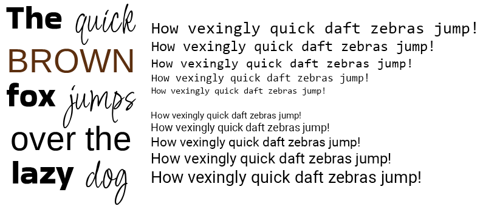

# Truety
A small TrueType font rendering library.

# Features
- Hinting
  - The bytecode interpreter (hinter) is designed to match the results produced by FreeType's V40 Interpreter (with backward compatibility enabled).
- Small and easy to use
  - Consists of a single header file and a single source file.
  - No dependencies (besides the C standard library).
  - Should compile with any C11 compiler.
- Supports TrueType (.ttf) files and OpenType (.otf) files that contain TrueType outlines.

# Limitations
- Some things are not fully implemented yet
    - Only ~75% of bytecode instructions have been implemented so far.
    - Not all supported encoding formats provided by the *cmap* table are handled yet.
    - The *vmtx* table is not currently used even if it is present.
- There is limited error checking:
    - This library does not adequately validate the integrity of font files. For this reason, it should only be used with trusted font files.
- Unicode is the only supported character encoding.

# Acknowledgements
[FreeType](https://freetype.org/) and [stb_truetype](https://github.com/nothings/stb/blob/master/stb_truetype.h) are two other font rendering libraries that served as great references while creating Truety.
